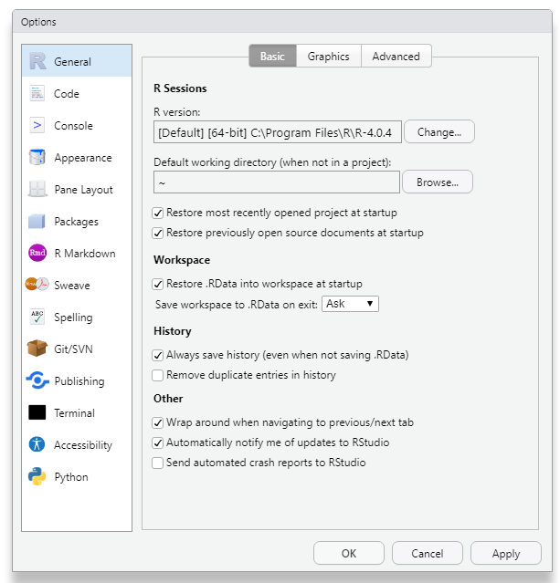
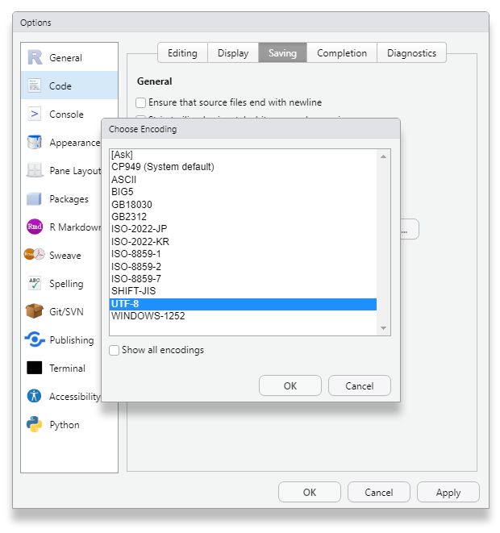

# R 언어란?

- 통계 분석에 특화된 언어
- 통계 및 그래프 작업을 위한 인터프리터 프로그래밍 언어
- 뛰어난 시각화
- 각종 통계 패키지 제공(파이썬보다 많음) -> 처리 속도는 느린 편
- 범용 프로그래밍 언어가 아니기에 서비스 적용이 어려움(ex, 대규모 IT 서비스, 웹, app, DB로 확장 등)
- 분석 분야에 한정되는 사용용도가 단점


# R Studio 기초

- console reset : `ctrl` +`L`

- terminal : cmd 

- new terminal : `alt`+`shift`+`R`

- environment : 데이터 세트나 작성 변수에 해당하는 내용 표시

- 변수 생성 방법

  ```R
  math<-86
  ```
  
- 한줄 실행 방법 :  코드 뒤에서 `ctrl`+`enter`

- 여러줄 실행 : 실행코드 드래그 블록 (`ctrl`+`enter`)

- 전체코드 실행 : `ctrl` + `alt` + `R` (주석 처리 내용도 포함)

- 마지막 실행코드 다시 실행 : 

- history : R studio로 작업한 이전의 모든 내용들 표시

- connection : db서버 연결 관리

- plots : 그래프 출력

- packages : 패키지 설치 및 미설치 패키지 목록 표시

- viewer : 아웃풋들이 웹코드인 경우 표시

  ## 시작폴더 설정

  Tools/Global Option에서 Default working directory 수정(내 문서가 아닌 R Study 폴더로 기본 설정)

  

  

  

  ## 한글 설정

  Tools -> Global Option -> Code -> Saving

  

